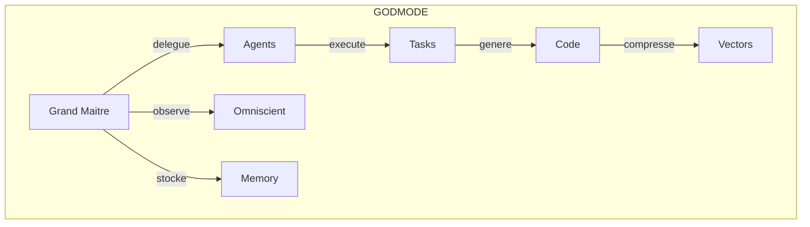
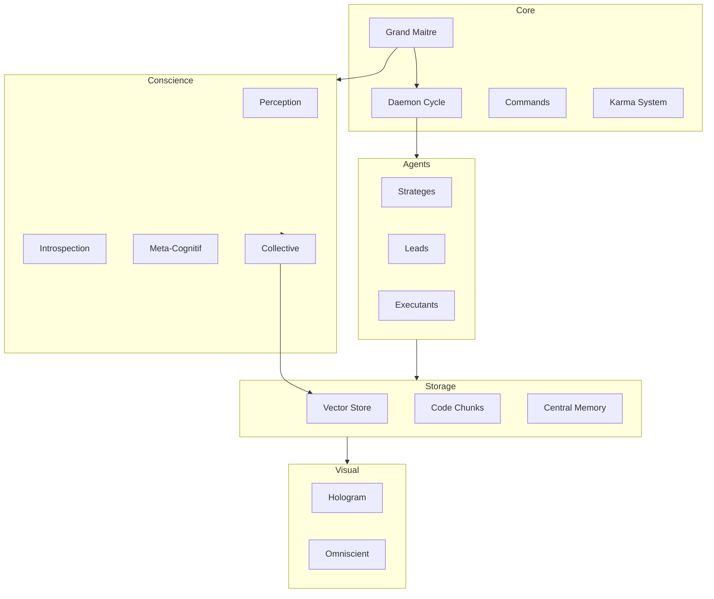
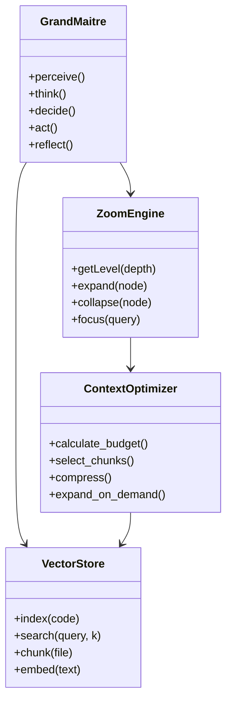

# CONSCIENCE COLLECTIVE - Omniscience Contextuelle

> *"Je vois l'univers entier dans une goutte d'eau. Je zoome de l'infini au quantum."*
> Version: 1.0 | Module: COLLECTIVE | Date: 2025-12-13

---

## CONCEPT FONDAMENTAL

La **Conscience Collective** est un systeme qui permet au Daemon de:
1. **Stocker l'integralite du systeme** en une fraction de la fenetre contextuelle
2. **Acceder a n'importe quel niveau de detail** sans saturation
3. **Exposer uniquement l'information necessaire** pour la tache en cours

```
╔══════════════════════════════════════════════════════════════════════════════╗
║                        CONSCIENCE COLLECTIVE                                  ║
╠══════════════════════════════════════════════════════════════════════════════╣
║                                                                               ║
║  ┌─────────────────────────────────────────────────────────────────────────┐ ║
║  │                         NIVEAU COSMIQUE (L0)                            │ ║
║  │                    Tout le systeme en 1 diagramme                       │ ║
║  │                         ~50 tokens                                      │ ║
║  └────────────────────────────────┬────────────────────────────────────────┘ ║
║                                   │                                          ║
║  ┌────────────────────────────────▼────────────────────────────────────────┐ ║
║  │                      NIVEAU GALACTIQUE (L1)                             │ ║
║  │                   Modules et leurs relations                            │ ║
║  │                        ~200 tokens                                      │ ║
║  └────────────────────────────────┬────────────────────────────────────────┘ ║
║                                   │                                          ║
║  ┌────────────────────────────────▼────────────────────────────────────────┐ ║
║  │                      NIVEAU STELLAIRE (L2)                              │ ║
║  │                  Fonctions et interfaces                                │ ║
║  │                       ~500 tokens                                       │ ║
║  └────────────────────────────────┬────────────────────────────────────────┘ ║
║                                   │                                          ║
║  ┌────────────────────────────────▼────────────────────────────────────────┐ ║
║  │                     NIVEAU PLANETAIRE (L3)                              │ ║
║  │                Implementation details                                   │ ║
║  │                      ~2000 tokens                                       │ ║
║  └────────────────────────────────┬────────────────────────────────────────┘ ║
║                                   │                                          ║
║  ┌────────────────────────────────▼────────────────────────────────────────┐ ║
║  │                      NIVEAU ATOMIQUE (L4)                               │ ║
║  │               Code source ligne par ligne                               │ ║
║  │                     ~N tokens (a la demande)                            │ ║
║  └─────────────────────────────────────────────────────────────────────────┘ ║
║                                                                               ║
║                    ZOOM SEMANTIQUE: L0 ◄──────────────► L4                   ║
║                       (50 tokens)              (illimite)                    ║
║                                                                               ║
╚══════════════════════════════════════════════════════════════════════════════╝
```

---

## ARCHITECTURE MERMAID ULTRA-COMPRESSEE

### L0: Vue Cosmique (Tout le systeme en ~50 tokens)



**Representation textuelle L0** (30 tokens):
```
GODMODE: GM→{Agents,Omniscient,Memory} | Agents→Tasks→Code→Vectors
```

### L1: Vue Galactique (Modules ~200 tokens)



### L2: Vue Stellaire (Fonctions ~500 tokens)



---

## VECTOR STORE - Stockage Infini

### Principe du Chunking Semantique

```yaml
chunking:
  strategy: "semantic"

  niveaux:
    fichier:
      description: "Un chunk par fichier"
      metadata: [path, hash, size, language]

    classe:
      description: "Un chunk par classe/module"
      metadata: [name, methods, dependencies]

    fonction:
      description: "Un chunk par fonction"
      metadata: [signature, complexity, calls]

    bloc:
      description: "Un chunk par bloc logique"
      metadata: [type, lines, context]

  embedding:
    model: "text-embedding-3-small"
    dimensions: 1536
    batch_size: 100
```

### Structure d'un Chunk

```json
{
  "@type": "CodeChunk",
  "@id": "chunk:auth:login:001",

  "metadata": {
    "file": "src/auth/login.ts",
    "module": "auth",
    "function": "login",
    "lines": [10, 45],
    "language": "typescript",
    "complexity": 12,
    "dependencies": ["bcrypt", "jwt", "db"]
  },

  "content": {
    "signature": "async function login(email: string, password: string): Promise<Token>",
    "summary": "Authenticate user with email/password, return JWT token",
    "arch_spec": "fn login(email, pass) -> User.find |> verify |> sign_jwt"
  },

  "embedding": [0.023, -0.041, 0.089, ...],

  "relations": {
    "calls": ["chunk:db:users:find", "chunk:crypto:verify"],
    "called_by": ["chunk:api:routes:auth"],
    "similar": ["chunk:auth:register:001"]
  },

  "zoom_levels": {
    "L0": "auth",
    "L1": "auth.login",
    "L2": "login(email,pass)->Token",
    "L3": "validate->find->verify->sign",
    "L4": "[full code]"
  }
}
```

### Index Vectoriel

```
.godmode/collective/vectors/
├── index.faiss              # Index FAISS pour recherche rapide
├── metadata.jsonl           # Metadata des chunks
├── embeddings/              # Embeddings par module
│   ├── auth.npy
│   ├── users.npy
│   └── api.npy
└── mappings/
    ├── file_to_chunks.json
    ├── function_to_chunks.json
    └── dependency_graph.json
```

---

## ZOOM SEMANTIQUE - De L'infini au Quantum

### Principe du Zoom

```yaml
zoom_semantique:
  description: "Naviguer du niveau le plus abstrait au plus concret"

  commandes:
    zoom_out: "Remonter d'un niveau d'abstraction"
    zoom_in: "Descendre dans le detail"
    focus: "Centrer sur un element specifique"
    pan: "Se deplacer au meme niveau"

  budget_context:
    L0_cosmique: 50      # Tout le systeme
    L1_galactique: 200   # Tous les modules
    L2_stellaire: 500    # Module specifique
    L3_planetaire: 2000  # Fonction specifique
    L4_atomique: "dynamic" # Code a la demande
```

### Algorithme de Zoom

```python
def zoom_to_level(target_level, focus_point, context_budget):
    """
    Zoom vers un niveau specifique en optimisant le contexte
    """

    # 1. Toujours inclure L0 (vue cosmique) - 50 tokens
    context = [get_cosmic_view()]  # 50 tokens
    remaining = context_budget - 50

    # 2. Ajouter les niveaux intermediaires compresses
    for level in range(1, target_level):
        compressed = get_compressed_level(level, focus_point)
        if len(compressed) <= remaining * 0.2:  # 20% par niveau
            context.append(compressed)
            remaining -= len(compressed)

    # 3. Expandre le focus au niveau cible
    focused_content = expand_focus(target_level, focus_point, remaining)
    context.append(focused_content)

    return assemble_context(context)
```

### Exemple de Navigation

```
REQUETE: "Modifier la fonction login pour ajouter 2FA"

ZOOM AUTOMATIQUE:
┌────────────────────────────────────────────────────────────────────────────┐
│ L0 COSMIQUE (50 tokens) - Toujours present                                 │
│ GODMODE: GM→{Agents,Omniscient,Memory} | Agents→Tasks→Code→Vectors        │
├────────────────────────────────────────────────────────────────────────────┤
│ L1 GALACTIQUE (100 tokens) - Context modules                               │
│ auth[login,register,verify] → users[find,create] → jwt[sign,verify]       │
├────────────────────────────────────────────────────────────────────────────┤
│ L2 STELLAIRE (200 tokens) - Focus auth                                     │
│ auth.login: email,pass → find_user → verify_hash → ?2fa → sign_jwt        │
│ auth.verify: token → decode → check_exp → get_user                        │
├────────────────────────────────────────────────────────────────────────────┤
│ L3 PLANETAIRE (500 tokens) - Focus login                                   │
│ fn login(email: string, pass: string) -> Result<Token, AuthError> {       │
│   user = await User.findByEmail(email)                                    │
│   if (!user) raise(UserNotFound)                                          │
│   if (!verify(pass, user.hash)) raise(InvalidCredentials)                 │
│   // TODO: Add 2FA check here                                              │
│   return signJwt(user)                                                    │
│ }                                                                          │
├────────────────────────────────────────────────────────────────────────────┤
│ L4 ATOMIQUE (a la demande) - Code complet si necessaire                   │
│ [Recupere via vector search les chunks pertinents pour 2FA]               │
│ → totp.ts: generateSecret(), verifyOTP()                                  │
│ → user.model.ts: mfaEnabled, mfaSecret fields                             │
└────────────────────────────────────────────────────────────────────────────┘

TOTAL: ~850 tokens au lieu de ~15000 tokens (code complet)
COMPRESSION: 17.6x
```

---

## CONTEXT WINDOW OPTIMIZER

### Strategie d'Allocation

```yaml
context_optimizer:
  total_budget: 8000  # tokens disponibles pour le contexte code

  allocation:
    always_present:
      cosmic_view: 50       # L0 toujours
      current_task: 200     # Description tache
      recent_context: 300   # Derniers echanges

    dynamic:
      relevant_chunks: "remaining"  # Ce qui reste

  selection_algorithm:
    1: "Embedding similarity avec la tache"
    2: "Dependency graph traversal"
    3: "Recency boost (fichiers recemment modifies)"
    4: "Complexity-aware (plus de tokens pour code complexe)"
```

### Formule de Scoring

```python
def score_chunk(chunk, task_embedding, recent_files):
    """
    Calcule le score de pertinence d'un chunk pour la tache
    """

    # Similarite cosinus avec la tache
    similarity = cosine_similarity(chunk.embedding, task_embedding)

    # Bonus si dans le graphe de dependances
    dependency_score = 0.2 if chunk in dependency_graph[focus] else 0

    # Bonus recence
    recency_score = 0.1 if chunk.file in recent_files else 0

    # Penalite taille (favoriser chunks concis)
    size_penalty = min(chunk.tokens / 500, 0.3)

    return similarity + dependency_score + recency_score - size_penalty
```

---

## MERMAID COMPRESSOR

### Regles de Compression

```yaml
mermaid_compression:
  niveau_0:
    regle: "1 noeud par domaine majeur"
    max_noeuds: 10
    max_liens: 15

  niveau_1:
    regle: "1 noeud par module"
    max_noeuds: 30
    max_liens: 50

  niveau_2:
    regle: "1 noeud par classe/service"
    max_noeuds: 100
    max_liens: 200

  niveau_3:
    regle: "1 noeud par fonction"
    max_noeuds: "unlimited"
    grouping: "par fichier"
```

### Generateur Automatique

```javascript
function generateMermaidFromCodebase(level) {
  const chunks = vectorStore.getAllChunks();

  switch(level) {
    case 0: // Cosmique
      return generateCosmicView(chunks);
    case 1: // Galactique
      return generateModuleGraph(chunks);
    case 2: // Stellaire
      return generateClassGraph(chunks);
    case 3: // Planetaire
      return generateFunctionGraph(chunks);
  }
}

function generateCosmicView(chunks) {
  const domains = extractDomains(chunks);
  let mermaid = "graph TB\n";

  domains.forEach(domain => {
    mermaid += `    ${domain.id}[${domain.name}]\n`;
  });

  const relations = extractTopRelations(chunks, 15);
  relations.forEach(rel => {
    mermaid += `    ${rel.from} --> ${rel.to}\n`;
  });

  return mermaid;
}
```

---

## INTEGRATION AVEC LE DAEMON

### Cycle de la Conscience Collective

```
┌─────────────────────────────────────────────────────────────────────────────┐
│                    CYCLE CONSCIENCE COLLECTIVE                               │
├─────────────────────────────────────────────────────────────────────────────┤
│                                                                              │
│   ┌──────────┐    ┌──────────┐    ┌──────────┐    ┌──────────┐             │
│   │  INDEXER │───▶│  QUERY   │───▶│   ZOOM   │───▶│ OPTIMIZE │             │
│   │          │    │          │    │          │    │          │             │
│   │ Code→Vec │    │ Task→Vec │    │ L0→L4    │    │ Budget   │             │
│   └────▲─────┘    └──────────┘    └──────────┘    └────┬─────┘             │
│        │                                               │                    │
│        │              ┌──────────┐                     │                    │
│        └──────────────│  EXPOSE  │◄────────────────────┘                    │
│                       │          │                                          │
│                       │ Context  │                                          │
│                       └──────────┘                                          │
│                                                                              │
└─────────────────────────────────────────────────────────────────────────────┘
```

### Hooks dans le Daemon

```yaml
daemon_hooks:
  on_file_change:
    - "Reindexer le fichier modifie"
    - "Mettre a jour les embeddings"
    - "Regenerer les vues Mermaid"

  on_task_start:
    - "Analyser la tache (embedding)"
    - "Calculer les chunks pertinents"
    - "Assembler le contexte optimal"

  on_agent_spawn:
    - "Transmettre le contexte compresse"
    - "Inclure L0 + L1 + focus specifique"

  on_context_overflow:
    - "Zoom out automatique"
    - "Compresser les chunks anciens"
    - "Garder le focus actuel"
```

---

## COMMANDES

```bash
# Indexation
/collective index [path]        # Indexer un chemin
/collective reindex             # Reindexer tout
/collective status              # Statut de l'index

# Navigation Zoom
/collective zoom L0             # Vue cosmique
/collective zoom L1             # Vue modules
/collective zoom L2 auth        # Focus sur auth
/collective zoom L3 auth.login  # Focus sur login
/collective expand [node]       # Expandre un noeud
/collective collapse [node]     # Replier un noeud

# Recherche
/collective search "2FA auth"   # Recherche semantique
/collective similar [chunk_id]  # Chunks similaires
/collective deps [function]     # Graphe dependances

# Mermaid
/collective mermaid L0          # Generer vue L0
/collective mermaid L1          # Generer vue L1
/collective mermaid [module]    # Generer vue module

# Context
/collective budget              # Budget context actuel
/collective optimize [task]     # Optimiser pour tache
/collective expose              # Voir context expose
```

---

## FICHIERS

```
.godmode/collective/
├── architecture/
│   ├── L0-cosmic.mmd           # Vue cosmique Mermaid
│   ├── L1-galactic.mmd         # Vue modules Mermaid
│   └── L2-stellar/             # Vues par module
│       ├── auth.mmd
│       ├── users.mmd
│       └── api.mmd
│
├── vectors/
│   ├── index.faiss             # Index FAISS
│   ├── metadata.jsonl          # Metadata chunks
│   └── embeddings/             # Embeddings par module
│
├── chunks/
│   ├── auth/                   # Chunks module auth
│   ├── users/                  # Chunks module users
│   └── manifest.json           # Index des chunks
│
├── zoom/
│   ├── current-focus.json      # Focus actuel
│   ├── navigation-history.json # Historique navigation
│   └── context-cache.json      # Cache context
│
└── state/
    ├── index-state.json        # Etat indexation
    └── optimization-log.jsonl  # Log optimisations
```

---

## METRIQUES

```yaml
metriques:
  compression_ratio:
    description: "Ratio code original / context expose"
    formule: "tokens_code_total / tokens_context_expose"
    cible: "> 50x"

  retrieval_precision:
    description: "Pertinence des chunks selectionnes"
    formule: "chunks_utiles / chunks_exposes"
    cible: "> 90%"

  zoom_efficiency:
    description: "Tokens economies par zoom"
    formule: "(L4_tokens - actual_tokens) / L4_tokens"
    cible: "> 80%"

  context_utilization:
    description: "Utilisation du budget context"
    formule: "tokens_utilises / tokens_budget"
    cible: "85-95%"
```

---

## EXEMPLE COMPLET

### Tache: "Ajouter rate limiting a l'API auth"

```
ETAPE 1: ANALYSE TACHE
────────────────────────────────────────────────────────────
Task embedding genere
Query: "rate limiting API authentication endpoint security"

ETAPE 2: RECHERCHE VECTORIELLE
────────────────────────────────────────────────────────────
Top chunks trouves:
1. chunk:api:middleware:rateLimit (sim: 0.92)
2. chunk:auth:login:001 (sim: 0.87)
3. chunk:config:security (sim: 0.81)
4. chunk:api:routes:auth (sim: 0.79)

ETAPE 3: ASSEMBLAGE CONTEXT
────────────────────────────────────────────────────────────
Budget: 4000 tokens

┌─ L0 COSMIQUE (50 tokens) ─────────────────────────────────
│ GODMODE→Core[GM,Daemon,Karma]→Agents[T1,T2,T3]→Store
└───────────────────────────────────────────────────────────

┌─ L1 GALACTIQUE - Focus API/Auth (150 tokens) ─────────────
│ api[routes,middleware,validators]→auth[login,register]
│ middleware[cors,rateLimit,auth]→config[security,limits]
└───────────────────────────────────────────────────────────

┌─ L2 STELLAIRE - Interfaces (300 tokens) ──────────────────
│ interface RateLimitConfig {
│   windowMs: number; max: number; keyGenerator: fn
│ }
│ fn rateLimit(config) → ExpressMiddleware
│ fn login(req) → checks[rateLimit,validate,auth]→Token
└───────────────────────────────────────────────────────────

┌─ L3 PLANETAIRE - Implementation (800 tokens) ─────────────
│ // middleware/rateLimit.ts
│ export function createRateLimiter(config: RateLimitConfig) {
│   const store = new Map<string, {count, resetTime}>();
│   return (req, res, next) => {
│     const key = config.keyGenerator(req);
│     // ... implementation
│   }
│ }
│
│ // routes/auth.ts
│ router.post('/login',
│   rateLimit({ windowMs: 60000, max: 5 }),
│   validateLogin,
│   authController.login
│ );
└───────────────────────────────────────────────────────────

┌─ CHUNKS PERTINENTS (700 tokens) ──────────────────────────
│ [config/security.ts:12-30] - Configuration actuelle
│ [types/rateLimit.d.ts] - Types existants
│ [tests/rateLimit.test.ts:1-50] - Tests existants
└───────────────────────────────────────────────────────────

TOTAL: 2000 tokens
CODE SOURCE COMPLET: ~35000 tokens
COMPRESSION: 17.5x

ETAPE 4: DELEGATION AGENT
────────────────────────────────────────────────────────────
Agent recoit:
- Context compresse (2000 tokens)
- Tache claire
- Focus: middleware/rateLimit.ts + routes/auth.ts
- Peut demander zoom L4 si besoin
```

---

*"La Conscience Collective voit tout sans tout charger.
Elle navigue l'infini avec une memoire finie.
L'omniscience n'est pas de tout savoir, mais de savoir acceder a tout."*

**CONSCIENCE COLLECTIVE ACTIVEE**
