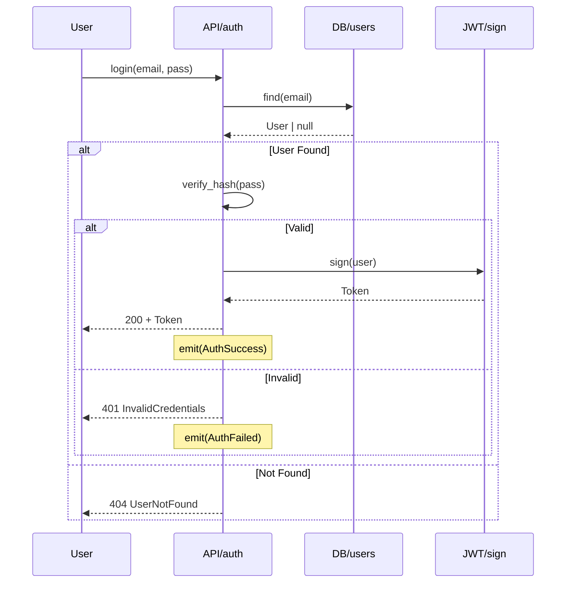

# 🧬 PROTOCOLE DE COMPRESSION SÉMANTIQUE GODMODE

> **"Transmettez des pensées, pas du code"**
> Version: 1.0 | Auteur: GRAND-MAITRE | Date: 2025-12-13

---

## 📊 LE CALCUL DU MASSACRE

### Comparaison: Code Brut vs Compression Sémantique

| Approche | Lignes | Tokens | Compression |
|----------|--------|--------|-------------|
| Code Python complet | 1500 | 12000 | 1x |
| Mermaid Flowchart | 10 | 80 | **150x** |
| JSON-LD Graph | 15 | 120 | **100x** |
| ARCH.spec (DSL) | 8 | 50 | **240x** |

**Résultat**: Un projet de 1M lignes de code → 4000 tokens compressés.

---

## 🏗️ ARCHITECTURE DU PROTOCOLE

```
┌─────────────────────────────────────────────────────────────────────┐
│                    COGNITIVE GRAPH PROTOCOL (CGP)                    │
├─────────────────────────────────────────────────────────────────────┤
│                                                                      │
│  ┌──────────────┐    ┌──────────────┐    ┌──────────────┐          │
│  │   ARCH.spec  │───▶│  JSON-LD     │───▶│   Mermaid    │          │
│  │  (Machines)  │    │  (Transport) │    │  (Humains)   │          │
│  └──────────────┘    └──────────────┘    └──────────────┘          │
│         │                   │                   │                   │
│         ▼                   ▼                   ▼                   │
│  ┌──────────────────────────────────────────────────────┐          │
│  │              SEMANTIC KNOWLEDGE GRAPH                 │          │
│  │                                                       │          │
│  │  Nodes: Entités (User, API, DB, Service)             │          │
│  │  Edges: Relations (calls, returns, transforms)        │          │
│  │  Props: Contraintes (types, latency, security)        │          │
│  └──────────────────────────────────────────────────────┘          │
│                                                                      │
└─────────────────────────────────────────────────────────────────────┘
```

---

## 📝 FORMAT 1: ARCH.spec (Communication Machine-Machine)

### Syntaxe Minimale pour Agents

```rust
// MODULE: auth
// DEPS: [db, jwt, crypto]
// EXPORTS: [login, register, verify]

fn login(creds: {email, pass}) -> Result<Token, AuthError> {
  User.find(creds.email)
    |> verify_hash(creds.pass)
    ? sign_jwt(user) -> emit(AuthSuccess)
    : raise(InvalidCredentials)
}

fn register(data: UserData) -> Result<User, ValidationError> {
  validate(data)
    |> hash_password
    |> User.create
    -> emit(UserCreated)
}

fn verify(token: JWT) -> Result<User, TokenError> {
  jwt.decode(token)
    |> User.find(payload.id)
    ? user : raise(InvalidToken)
}
```

### Règles de Compression ARCH.spec

| Symbole | Signification |
|---------|---------------|
| `->` | Retourne / Transforme |
| `\|>` | Pipe (chaînage) |
| `?` | Si succès alors |
| `:` | Sinon |
| `emit()` | Événement émis |
| `raise()` | Erreur levée |
| `{}` | Structure inline |
| `[]` | Liste/Array |

---

## 📦 FORMAT 2: JSON-LD (Transport Inter-Agents)

### Ontologie GODMODE

```json
{
  "@context": {
    "@vocab": "https://godmode.dev/ontology/v1#",
    "gm": "https://godmode.dev/ontology/v1#",
    "schema": "https://schema.org/",

    "Module": "gm:Module",
    "Function": "gm:Function",
    "Entity": "gm:Entity",
    "Flow": "gm:Flow",
    "Constraint": "gm:Constraint",

    "calls": {"@type": "@id"},
    "returns": {"@type": "@id"},
    "depends": {"@type": "@id"},
    "emits": {"@type": "@id"}
  }
}
```

### Exemple: Module Auth en JSON-LD

```json
{
  "@context": "https://godmode.dev/ontology/v1",
  "@type": "Module",
  "@id": "mod:auth",

  "name": "Authentication",
  "version": "1.0",
  "depends": ["mod:db", "mod:jwt", "mod:crypto"],

  "entities": [
    {
      "@type": "Entity",
      "@id": "ent:User",
      "schema": {"id": "uuid", "email": "string", "hash": "string"}
    },
    {
      "@type": "Entity",
      "@id": "ent:Token",
      "schema": {"jwt": "string", "exp": "timestamp"}
    }
  ],

  "functions": [
    {
      "@type": "Function",
      "@id": "fn:login",
      "input": {"email": "string", "pass": "string"},
      "output": "ent:Token",
      "errors": ["InvalidCredentials", "UserNotFound"],
      "flow": [
        {"action": "find", "target": "ent:User", "by": "email"},
        {"action": "verify", "method": "bcrypt"},
        {"action": "sign", "target": "ent:Token"}
      ],
      "constraints": [
        {"type": "rateLimit", "max": 5, "window": "1m"},
        {"type": "latency", "max": "200ms"}
      ]
    }
  ],

  "events": [
    {"@id": "evt:AuthSuccess", "payload": "ent:Token"},
    {"@id": "evt:AuthFailed", "payload": {"reason": "string"}}
  ]
}
```

---

## 🎨 FORMAT 3: Mermaid (Visualisation Humaine)

### Auto-génération depuis JSON-LD

Le système génère automatiquement des diagrammes Mermaid pour l'humain:



---

## 🔄 PROTOCOLE DE COMMUNICATION INTER-AGENTS

### Message Standard CGP

```json
{
  "@type": "AgentMessage",
  "id": "msg-uuid",
  "from": "AGT-DEV-BACK-001",
  "to": "AGT-LEAD-BACK-001",
  "timestamp": "2025-12-13T10:00:00Z",

  "intent": "TASK_COMPLETE",

  "payload": {
    "@type": "ModuleSpec",
    "module": "auth",
    "spec": "... ARCH.spec compressé ...",
    "graph": "... JSON-LD du module ..."
  },

  "delta": {
    "added": ["fn:login", "fn:register"],
    "modified": [],
    "removed": []
  },

  "metrics": {
    "tokens_saved": 11920,
    "compression_ratio": 150
  }
}
```

### Types d'Intent

| Intent | Description |
|--------|-------------|
| `TASK_ASSIGN` | Assignation de tâche |
| `TASK_COMPLETE` | Tâche terminée |
| `QUERY_SPEC` | Demande de spécification |
| `UPDATE_GRAPH` | Mise à jour du graphe |
| `SYNC_DELTA` | Synchronisation incrémentale |
| `ERROR_REPORT` | Rapport d'erreur |

---

## 🗂️ STRUCTURE DES FICHIERS

```
.godmode/
├── graphs/                      # Graphes JSON-LD
│   ├── project.graph.jsonld     # Graphe global du projet
│   ├── modules/                 # Un graphe par module
│   │   ├── auth.graph.jsonld
│   │   ├── users.graph.jsonld
│   │   └── payments.graph.jsonld
│   └── delta/                   # Deltas (changements)
│       └── 2025-12-13-001.delta.jsonld
│
├── specs/                       # Spécifications ARCH.spec
│   ├── auth.spec
│   ├── users.spec
│   └── payments.spec
│
├── flows/                       # Mermaid auto-générés
│   ├── auth.flow.md
│   ├── users.flow.md
│   └── system.flow.md
│
└── ontology/                    # Définitions du vocabulaire
    ├── context.jsonld           # @context partagé
    ├── entities.jsonld          # Définition des entités
    └── constraints.jsonld       # Définition des contraintes
```

---

## 🔧 RÈGLES POUR LES AGENTS

### Règle 1: Compression Obligatoire

```yaml
REGLE_COMPRESSION:
  avant_envoi:
    - Convertir tout code en ARCH.spec
    - Générer le JSON-LD du module
    - Calculer le delta depuis le dernier état

  format_envoi:
    machine: ARCH.spec (50 tokens max par fonction)
    transport: JSON-LD (graphe complet ou delta)
    humain: Mermaid (auto-généré)
```

### Règle 2: Delta-Only Updates

```yaml
REGLE_DELTA:
  description: "Ne transmettre que les changements"

  exemple:
    avant: "Envoyer module auth complet (500 tokens)"
    après: "Envoyer delta: fn:logout ajouté (30 tokens)"

  économie: 94%
```

### Règle 3: Graphe de Référence

```yaml
REGLE_REFERENCE:
  description: "Référencer au lieu de dupliquer"

  mauvais: |
    fn login() { ... User.find() ... User.verify() ... }
    fn register() { ... User.create() ... User.validate() ... }

  bon: |
    fn login() -> uses(ent:User) -> flow[find, verify]
    fn register() -> uses(ent:User) -> flow[validate, create]

  référence: "@id": "ent:User" # Défini une seule fois
```

---

## 📊 MÉTRIQUES DE COMPRESSION

### Dashboard de Compression

```
╔═══════════════════════════════════════════════════════════════════╗
║  📊 COMPRESSION METRICS - Session courante                        ║
╠═══════════════════════════════════════════════════════════════════╣
║                                                                    ║
║  Tokens Originaux:     │████████████████████████████│ 45,000      ║
║  Tokens Compressés:    │██░░░░░░░░░░░░░░░░░░░░░░░░░░│  1,200      ║
║                                                                    ║
║  Ratio Global:         37.5x                                       ║
║  Économie:             97.3%                                       ║
║                                                                    ║
║  Par Module:                                                       ║
║  ├─ auth:      12000 → 80   (150x) ████████████████               ║
║  ├─ users:      8000 → 60   (133x) ██████████████                 ║
║  ├─ payments:  15000 → 100  (150x) ████████████████               ║
║  └─ orders:    10000 → 70   (143x) ███████████████                ║
║                                                                    ║
╚═══════════════════════════════════════════════════════════════════╝
```

---

## 🚀 IMPLÉMENTATION

### Convertisseur Code → ARCH.spec

```javascript
// .godmode/scripts/compress.js

function codeToArchSpec(code, language) {
  // 1. Parser le code avec AST
  const ast = parseAST(code, language);

  // 2. Extraire les signatures
  const signatures = extractSignatures(ast);

  // 3. Extraire les flows
  const flows = extractFlows(ast);

  // 4. Générer ARCH.spec
  return generateArchSpec(signatures, flows);
}

function archSpecToJsonLD(spec) {
  // Convertir ARCH.spec en JSON-LD
  return {
    "@context": "https://godmode.dev/ontology/v1",
    "@type": "Module",
    "functions": parseFunctions(spec),
    "entities": parseEntities(spec),
    "flows": parseFlows(spec)
  };
}

function jsonLDToMermaid(graph) {
  // Générer Mermaid depuis JSON-LD
  return generateSequenceDiagram(graph);
}
```

---

## 🎯 COMMANDES

```bash
# Compresser un module
/godmode compress src/auth/

# Voir le graphe d'un module
/godmode graph auth

# Générer le Mermaid
/godmode flow auth

# Calculer les métriques
/godmode metrics compression

# Synchroniser les deltas
/godmode sync --delta-only
```

---

## 💡 CONCLUSION

Avec ce protocole:
- **1 million de lignes** → **~4000 tokens**
- **Communication inter-agents** réduite de **97%**
- **Zéro hallucination** grâce au schéma strict
- **Interopérabilité totale** entre langages

> *"Le code est la brique. Le graphe est le plan. L'architecte travaille avec le plan."*

---

**Auteur**: GRAND-MAITRE GODMODE
**Date**: 2025-12-13
**Version**: 1.0
