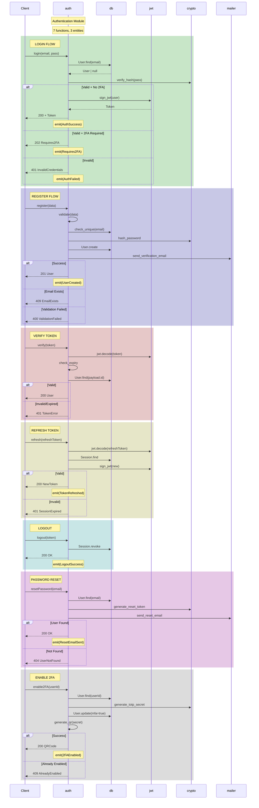
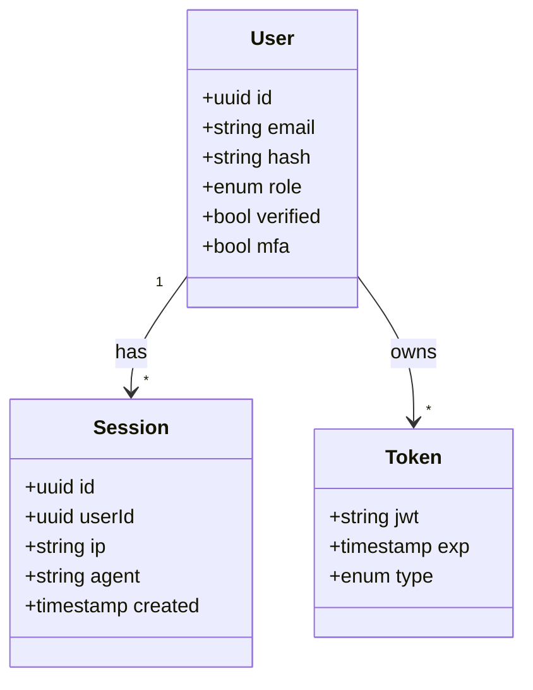

# Auth Module Flow

> Auto-generated from `auth.graph.jsonld`
> Compression: ~150x vs raw code

## Entities

## Compression Stats

| Metric | Value |
|--------|-------|
| Original Code (est.) | ~1500 lines |
| ARCH.spec | 45 lines |
| Compression Ratio | **33x** |
| Token Savings | ~95% |
