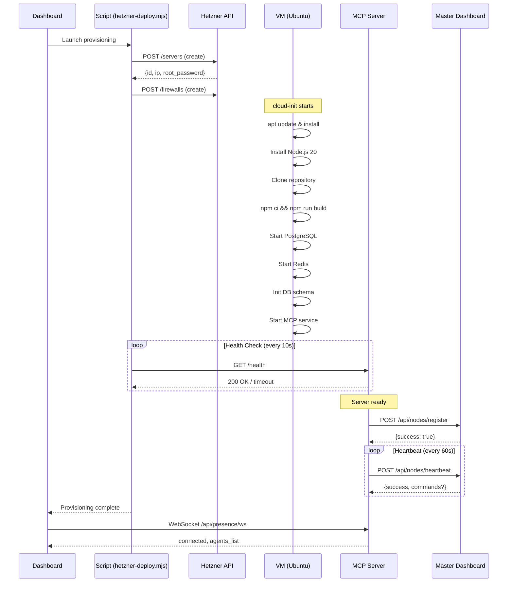

# MCP Agent Server - API Documentation

**Base URL:** `http://46.224.132.151:3000`
**Master Token:** `master-de9f20e9-c9d4-4dc6-834b-e25481fb56d5`

---

## Authentication

Toutes les requetes (sauf endpoints publics) requierent un Bearer token:

```http
Authorization: Bearer <token>
```

**Format Token:** `prefix-uuid` (ex: `master-xxxxx`, `agent-xxxxx`)

---

## Table des Contenus

1. [Health & Monitoring](#health--monitoring)
2. [Dashboard WebSocket (Real-Time)](#dashboard-websocket-real-time)
3. [Server Presence API (External Dashboard)](#server-presence-api-external-dashboard)
4. [Hetzner Auto-Provisioning](#hetzner-auto-provisioning)
5. [Agents API](#agents-api)
6. [Tokens API](#tokens-api)
7. [Credentials API](#credentials-api)
8. [Workspaces API](#workspaces-api)
9. [Projects API](#projects-api)
10. [Filesystem API](#filesystem-api)
11. [Terminal API (Real-Time)](#terminal-api-real-time)
12. [Messages API (Claude AI)](#messages-api-claude-ai)

---

## Health & Monitoring

### GET /health
Health check complet du systeme.

```bash
curl http://46.224.132.151:3000/health
```

**Response:**
```json
{
  "status": "healthy|degraded|unhealthy",
  "version": "1.0.0",
  "environment": "production",
  "uptime": 12345,
  "timestamp": "2025-12-13T17:00:00.000Z",
  "checks": {
    "database": { "status": "up", "latencyMs": 5 },
    "claudeCli": { "status": "up", "latencyMs": 100 },
    "filesystem": { "status": "up", "latencyMs": 2 },
    "memory": { "status": "up" }
  },
  "metrics": {
    "memory": { "heapUsed": 50000000, "heapTotal": 100000000 },
    "circuitBreakers": [...],
    "rateLimiting": { "blockedIPsCount": 0 }
  }
}
```

### GET /healthz
Liveness probe (Kubernetes).

### GET /ready
Readiness probe (Kubernetes).

### GET /startup
Startup probe (Kubernetes).

### GET /metrics
Metriques Prometheus.

---

## Dashboard WebSocket (Real-Time)

### WebSocket: /ws/dashboard

Connexion WebSocket pour recevoir les evenements en temps reel.

```javascript
const ws = new WebSocket('ws://46.224.132.151:3000/ws/dashboard');

ws.onopen = () => {
  console.log('Connected to dashboard');
};

ws.onmessage = (event) => {
  const data = JSON.parse(event.data);
  console.log('Event:', data.type, data.data);
};
```

#### Messages Client -> Serveur

| Action | Description | Payload |
|--------|-------------|---------|
| `ping` | Keepalive | `{ "action": "ping" }` |
| `subscribe` | S'abonner a un topic | `{ "action": "subscribe", "topic": "agents" }` |
| `unsubscribe` | Se desabonner | `{ "action": "unsubscribe", "topic": "agents" }` |
| `get_state` | Demander l'etat actuel | `{ "action": "get_state" }` |
| `get_agent_details` | Details d'un agent | `{ "action": "get_agent_details", "agentId": "agent_xxx" }` |

#### Topics de Subscription

| Topic | Description |
|-------|-------------|
| `all` | Tous les evenements (defaut) |
| `agents` | Evenements agents uniquement |
| `tasks` | Evenements taches uniquement |
| `projects` | Evenements projets uniquement |
| `system` | Stats systeme uniquement |
| `agent:{id}` | Evenements d'un agent specifique |
| `project:{id}` | Evenements d'un projet specifique |

#### Types d'Evenements (Serveur -> Client)

```typescript
type DashboardEventType =
  | 'initial_state'      // Etat initial a la connexion
  | 'agent_update'       // Agent mis a jour
  | 'agent_created'      // Nouvel agent cree
  | 'agent_deleted'      // Agent supprime
  | 'project_created'    // Nouveau projet
  | 'project_update'     // Projet mis a jour
  | 'project_deleted'    // Projet supprime
  | 'task_started'       // Tache demarree
  | 'task_progress'      // Progression tache
  | 'task_completed'     // Tache terminee
  | 'task_error'         // Erreur tache
  | 'todo_update'        // MAJ todo list
  | 'message_sent'       // Message inter-agent envoye
  | 'message_received'   // Message recu
  | 'system_stats'       // Stats systeme (toutes les 5s)
  | 'auth_info';         // Info auth
```

#### Structure Evenement

```json
{
  "type": "agent_update",
  "timestamp": "2025-12-13T17:00:00.000Z",
  "data": { ... }
}
```

#### Etat Initial (initial_state)

```json
{
  "type": "initial_state",
  "data": {
    "agents": [{
      "id": "agent_master",
      "name": "master",
      "status": "active",
      "role": "master",
      "stats": {
        "tasksCompleted": 10,
        "tasksFailed": 0,
        "uptime": 12345
      }
    }],
    "activeTasks": [{
      "taskId": "task_xxx",
      "projectId": "proj_xxx",
      "agentId": "agent_xxx",
      "status": "running",
      "progress": 50,
      "message": "Processing..."
    }],
    "projects": [{
      "id": "proj_xxx",
      "name": "My Project",
      "status": "active",
      "progress": 75,
      "totalTasks": 10,
      "completedTasks": 7
    }],
    "systemStats": {
      "uptime": 12345,
      "memoryUsage": { "used": 500000000, "total": 1000000000, "percentage": 50 },
      "cpuUsage": 25.5,
      "activeConnections": 3,
      "requestsPerMinute": 100
    },
    "serverVersion": "1.0.0"
  }
}
```

### GET /api/dashboard/state

Etat du dashboard via REST (alternative au WebSocket).

```bash
curl -H "Authorization: Bearer <token>" http://46.224.132.151:3000/api/dashboard/state
```

### GET /api/dashboard/clients

Nombre de clients WebSocket connectes.

```bash
curl -H "Authorization: Bearer <token>" http://46.224.132.151:3000/api/dashboard/clients
```

---

## Server Presence API (External Dashboard)

API pour connecter un dashboard externe (ex: mcp.ilinqsoft.com) au serveur MCP.
Permet de suivre l'etat du serveur, des agents, et de recevoir les mises a jour en temps reel.

### Architecture

```
┌─────────────────────┐      WebSocket/SSE       ┌─────────────────────┐
│  External Dashboard │◄─────────────────────────│   MCP Agent Server  │
│  (mcp.ilinqsoft.com)│                          │  (46.224.132.151)   │
└─────────────────────┘                          └─────────────────────┘
         │                                                │
         │  REST: /api/presence/*                         │
         │  WebSocket: /api/presence/ws                   │
         │  SSE: /api/presence/sse                        │
         └────────────────────────────────────────────────┘
```

### GET /api/presence/server

Informations sur le serveur MCP.

```bash
curl -H "Authorization: Bearer <token>" http://46.224.132.151:3000/api/presence/server
```

**Response:**
```json
{
  "success": true,
  "data": {
    "id": "srv_1702500000_abc123",
    "name": "mcp-agent-server",
    "version": "1.0.0",
    "host": "0.0.0.0",
    "port": 3000,
    "environment": "production",
    "startedAt": "2025-12-13T16:55:12.631Z",
    "uptime": 12345,
    "status": "online"
  }
}
```

### GET /api/presence/agents

Liste des agents avec leur presence.

```bash
curl -H "Authorization: Bearer <token>" http://46.224.132.151:3000/api/presence/agents
```

**Response:**
```json
{
  "success": true,
  "data": {
    "agents": [{
      "id": "agent_master",
      "name": "master",
      "unixUser": "claude",
      "engineType": "claude",
      "status": "active",
      "createdAt": "2025-12-13T16:55:12.631Z",
      "lastActiveAt": "2025-12-13T17:00:00.000Z",
      "workspacesCount": 2,
      "projectsCount": 5,
      "hasTerminalSession": true
    }],
    "count": 1,
    "timestamp": "2025-12-13T17:00:00.000Z"
  }
}
```

### GET /api/presence/stats

Statistiques de presence.

```bash
curl -H "Authorization: Bearer <token>" http://46.224.132.151:3000/api/presence/stats
```

### GET /api/presence/status

Status complet (serveur + agents + connexions).

```bash
curl -H "Authorization: Bearer <token>" http://46.224.132.151:3000/api/presence/status
```

**Response:**
```json
{
  "success": true,
  "data": {
    "server": { "id": "srv_xxx", "status": "online", "uptime": 12345 },
    "agents": {
      "list": [...],
      "count": 3,
      "byStatus": { "active": 2, "suspended": 1 },
      "byEngine": { "claude": 2, "openai": 1 },
      "withActiveTerminals": 1
    },
    "connections": {
      "dashboardsConnected": 2
    },
    "master": {
      "state": "connected",
      "nodeId": "node_abc123",
      "masterUrl": "https://mcp.ilinqsoft.com",
      "lastHeartbeat": "2025-12-13T17:00:00.000Z"
    },
    "timestamp": "2025-12-13T17:00:00.000Z"
  }
}
```

### GET /api/presence/master

Etat de la connexion au master dashboard.

```bash
curl -H "Authorization: Bearer <token>" http://46.224.132.151:3000/api/presence/master
```

**Response:**
```json
{
  "success": true,
  "data": {
    "state": "connected|connecting|disconnected|error|reconnecting",
    "nodeId": "node_abc123",
    "masterUrl": "https://mcp.ilinqsoft.com",
    "lastHeartbeat": "2025-12-13T17:00:00.000Z",
    "failedAttempts": 0
  }
}
```

### POST /api/presence/master/reconnect

Forcer la reconnexion au master dashboard.

```bash
curl -X POST -H "Authorization: Bearer <token>" \
  http://46.224.132.151:3000/api/presence/master/reconnect
```

### WebSocket: /api/presence/ws

Stream WebSocket pour recevoir les updates en temps reel.

```javascript
const ws = new WebSocket('ws://46.224.132.151:3000/api/presence/ws');

ws.onopen = () => {
  console.log('Connected to presence stream');
};

ws.onmessage = (event) => {
  const msg = JSON.parse(event.data);
  console.log('Type:', msg.type, 'Data:', msg.data);
};

// Demander un ping/heartbeat immediat
ws.send(JSON.stringify({ action: 'ping' }));

// Rafraichir la liste des agents
ws.send(JSON.stringify({ action: 'refresh_agents' }));

// Obtenir le status du serveur
ws.send(JSON.stringify({ action: 'get_server_status' }));
```

#### Messages Serveur -> Client

| Type | Description | Data |
|------|-------------|------|
| `connected` | Connexion etablie | `{ dashboardId, server, message }` |
| `server_status` | Status serveur | ServerInfo |
| `agents_list` | Liste complete agents | `{ agents[], count }` |
| `heartbeat` | Heartbeat (30s) | `{ server, agentsCount }` |
| `agent_added` | Nouvel agent | `{ agent }` |
| `agent_updated` | Agent modifie | `{ agent }` |
| `agent_removed` | Agent supprime | `{ agentId }` |
| `error` | Erreur | `{ message }` |

### GET /api/presence/sse

Alternative SSE (Server-Sent Events) pour browsers preferant SSE.

```javascript
const evtSource = new EventSource('http://46.224.132.151:3000/api/presence/sse');

evtSource.addEventListener('connected', (e) => {
  console.log('Connected:', JSON.parse(e.data));
});

evtSource.addEventListener('agents_list', (e) => {
  const data = JSON.parse(e.data);
  console.log('Agents:', data.agents);
});

evtSource.addEventListener('heartbeat', (e) => {
  console.log('Heartbeat:', JSON.parse(e.data));
});
```

---

## Hetzner Auto-Provisioning

Provisioning automatique de serveurs MCP sur Hetzner Cloud avec communication en temps reel du statut d'installation.

### Architecture du Provisioning

```
┌────────────────────┐     Hetzner API      ┌─────────────────────┐
│   hetzner-deploy   │─────────────────────►│   Hetzner Cloud     │
│   (script local)   │                      │   (Ubuntu 24.04)    │
└────────────────────┘                      └─────────────────────┘
         │                                           │
         │ 1. Create server                          │
         │ 2. Inject cloud-init                      │
         │                                           │
         │                          3. cloud-init run│
         │                          4. Setup script  │
         │                          5. MCP server    │
         │                                           ▼
         │                                  ┌─────────────────────┐
         │    5. Health check polling       │   MCP Agent Server  │
         │◄─────────────────────────────────│   (port 3000)       │
         │                                  └─────────────────────┘
         │                                           │
         │                                           │ 6. Connect to master
         │                                           ▼
         │                                  ┌─────────────────────┐
         │                                  │  Master Dashboard   │
         │                                  │(mcp.ilinqsoft.com)  │
         │                                  └─────────────────────┘
```

### Script de Deploiement

**Fichier:** `scripts/hetzner-deploy.mjs`

```bash
# Variables d'environnement
export HETZNER_API_TOKEN="your-hetzner-token"
export SERVER_TYPE="cax11"  # ARM server (defaut)
export LOCATION="fsn1"      # Falkenstein (defaut)

# Lancer le provisioning
node scripts/hetzner-deploy.mjs
```

### Processus d'Installation (Etapes)

Le script genere un cloud-init qui execute les etapes suivantes:

| Etape | Description | Duree estimee |
|-------|-------------|---------------|
| 1/9 | Disable password expiration | ~5s |
| 2/9 | Configure UFW firewall | ~10s |
| 3/9 | Enable Docker | ~5s |
| 4/9 | Install Node.js 20 | ~60s |
| 5/9 | Clone repository | ~30s |
| 6/9 | npm ci + build | ~90s |
| 7/9 | Start PostgreSQL & Redis | ~30s |
| 8/9 | Configure .env | ~5s |
| 9/9 | Init DB schema + Start MCP | ~30s |

**Total:** ~5 minutes

### Suivi du Provisioning

#### Methode 1: Health Check Polling (script)

Le script `hetzner-deploy.mjs` effectue automatiquement des health checks:

```javascript
// Le script poll /health toutes les 10 secondes
const checkHealth = async (ip) => {
  const res = await fetch(`http://${ip}:3000/health`);
  return res.status === 200;
};
```

#### Methode 2: Logs SSH

```bash
# Suivre l'installation en temps reel
ssh root@<IP> "tail -f /var/log/mcp-deploy.log"

# Ou via cloud-init
ssh root@<IP> "tail -f /var/log/cloud-init-output.log"

# Verifier si l'installation est terminee
ssh root@<IP> "test -f /opt/mcp/.ready && echo 'READY' || echo 'NOT READY'"
```

#### Methode 3: API Presence (une fois le serveur demarre)

```javascript
// Depuis le dashboard externe, connecter via WebSocket
const ws = new WebSocket(`ws://${serverIp}:3000/api/presence/ws`);

ws.onmessage = (e) => {
  const msg = JSON.parse(e.data);

  if (msg.type === 'connected') {
    console.log('Server is ready!', msg.data.server);
  }
};
```

### Communication Serveur -> Master Dashboard

Une fois le serveur MCP demarre, il se connecte automatiquement au master dashboard.

#### Configuration (Variables d'environnement)

```bash
# Sur le serveur MCP
MASTER_URL=https://mcp.ilinqsoft.com
MASTER_API_KEY=your-api-key
MASTER_SHARED_SECRET=your-shared-secret
NODE_ID=node_unique_id  # Auto-genere si non specifie

MASTER_RECONNECT_INTERVAL=30000   # 30s
MASTER_HEARTBEAT_INTERVAL=60000   # 60s
MASTER_TIMEOUT=10000              # 10s
```

#### Flow de Communication

```
┌─────────────────────────────────────────────────────────────────┐
│                     REGISTRATION FLOW                            │
├─────────────────────────────────────────────────────────────────┤
│                                                                  │
│  MCP Server                              Master Dashboard        │
│      │                                          │                │
│      │  POST /api/nodes/register                │                │
│      │  {nodeId, serverInfo, agents,            │                │
│      │   capabilities, timestamp, signature}    │                │
│      │─────────────────────────────────────────►│                │
│      │                                          │                │
│      │           {success: true, nodeId}        │                │
│      │◄─────────────────────────────────────────│                │
│      │                                          │                │
│      │  POST /api/nodes/heartbeat (every 60s)   │                │
│      │  {nodeId, serverId, uptime, agentsCount, │                │
│      │   activeTerminals, memoryUsage}          │                │
│      │─────────────────────────────────────────►│                │
│      │                                          │                │
│      │           {success, commands?}           │                │
│      │◄─────────────────────────────────────────│                │
│      │                                          │                │
│      │  POST /api/nodes/sync-agents             │                │
│      │  (when agents change)                    │                │
│      │─────────────────────────────────────────►│                │
│      │                                          │                │
└─────────────────────────────────────────────────────────────────┘
```

#### Types de Commandes Master -> Serveur

| Command | Description |
|---------|-------------|
| `refresh_agents` | Rafraichir le cache des agents |
| `sync_agents` | Synchroniser les agents avec le master |
| `update_config` | Mettre a jour la configuration |
| `restart` | Redemarrer le serveur (non implemente) |
| `execute` | Executer une commande (securise) |

#### Payload de Registration

```json
{
  "nodeId": "node_abc123def456",
  "serverInfo": {
    "id": "srv_1702500000_xyz",
    "name": "mcp-agent-server",
    "version": "1.0.0",
    "host": "0.0.0.0",
    "port": 3000,
    "environment": "production",
    "startedAt": "2025-12-13T16:55:12.631Z",
    "uptime": 0,
    "status": "online"
  },
  "agents": [{
    "id": "agent_master",
    "name": "master",
    "engineType": "claude",
    "status": "active"
  }],
  "capabilities": [
    "agents",
    "workspaces",
    "projects",
    "filesystem",
    "terminal-streaming",
    "multi-engine",
    "websocket",
    "sse"
  ],
  "timestamp": "2025-12-13T16:55:12.631Z",
  "signature": "hmac-sha256-signature"
}
```

### Credentials Output

Apres le provisioning, le script cree un fichier de credentials:

```bash
# Fichier: mcp-<SERVER_ID>.creds
IP=46.224.132.151
ID=115378395
ROOT=generated-root-password
API_KEY=generated-api-key-32bytes
DB_PASS=generated-db-password-16bytes
```

### Integration Dashboard pour le Provisioning

```tsx
// React: Suivi du provisioning d'un nouveau serveur

const ServerProvisioning = ({ serverIp }: { serverIp: string }) => {
  const [status, setStatus] = useState<'waiting' | 'connecting' | 'ready' | 'error'>('waiting');
  const [serverInfo, setServerInfo] = useState(null);
  const [agents, setAgents] = useState([]);

  useEffect(() => {
    // Polling health check pendant le provisioning
    const checkHealth = async () => {
      try {
        const res = await fetch(`http://${serverIp}:3000/health`);
        if (res.ok) {
          setStatus('connecting');
          // Serveur UP, connecter WebSocket
          connectWebSocket();
          return true;
        }
      } catch (e) {
        // Server not ready yet
      }
      return false;
    };

    const interval = setInterval(async () => {
      const ready = await checkHealth();
      if (ready) clearInterval(interval);
    }, 10000);

    return () => clearInterval(interval);
  }, [serverIp]);

  const connectWebSocket = () => {
    const ws = new WebSocket(`ws://${serverIp}:3000/api/presence/ws`);

    ws.onmessage = (e) => {
      const msg = JSON.parse(e.data);

      switch (msg.type) {
        case 'connected':
          setStatus('ready');
          setServerInfo(msg.data.server);
          break;

        case 'agents_list':
          setAgents(msg.data.agents);
          break;

        case 'agent_added':
          setAgents(prev => [...prev, msg.data.agent]);
          break;

        case 'agent_updated':
          setAgents(prev => prev.map(a =>
            a.id === msg.data.agent.id ? msg.data.agent : a
          ));
          break;
      }
    };

    ws.onerror = () => setStatus('error');
  };

  return (
    <div>
      <h2>Server Provisioning: {serverIp}</h2>
      <div>Status: {status}</div>

      {status === 'waiting' && (
        <div>Waiting for server to boot... (checking every 10s)</div>
      )}

      {status === 'ready' && serverInfo && (
        <div>
          <div>Server ID: {serverInfo.id}</div>
          <div>Version: {serverInfo.version}</div>
          <div>Uptime: {serverInfo.uptime}s</div>
          <div>Agents: {agents.length}</div>
        </div>
      )}
    </div>
  );
};
```

### Etapes de Provisioning Detaillees



---

## Agents API

### GET /api/agents
Liste tous les agents.

```bash
curl -H "Authorization: Bearer <token>" http://46.224.132.151:3000/api/agents
```

**Response:**
```json
{
  "agents": [{
    "id": "agent_master",
    "name": "master",
    "unixUser": "claude",
    "role": "master",
    "status": "active",
    "homeDir": "/home/claude",
    "engineType": "claude",
    "capabilities": ["*"],
    "createdAt": "2025-12-13T16:55:12.631Z"
  }],
  "count": 1
}
```

### GET /api/agents/:id
Details d'un agent.

```bash
curl -H "Authorization: Bearer <token>" http://46.224.132.151:3000/api/agents/agent_master
```

### POST /api/agents
Creer un agent (master requis).

```bash
curl -X POST -H "Authorization: Bearer <token>" \
  -H "Content-Type: application/json" \
  -d '{"name":"myagent","role":"developer","description":"Dev agent"}' \
  http://46.224.132.151:3000/api/agents
```

### POST /api/agents/provision
Provisioning complet d'un agent (cree user Unix, token, etc).

```bash
curl -X POST -H "Authorization: Bearer <token>" \
  -H "Content-Type: application/json" \
  -d '{
    "name": "agent1",
    "engineType": "claude",
    "apiKey": "sk-ant-xxx",
    "description": "Agent de dev"
  }' \
  http://46.224.132.151:3000/api/agents/provision
```

**Response:**
```json
{
  "success": true,
  "agent": {
    "id": "agent_xxx",
    "name": "agent1",
    "unixUser": "claude_agent1",
    "engineType": "claude",
    "status": "active"
  },
  "credentials": {
    "agentId": "agent_xxx",
    "token": "agent-xxxxx-xxxx-xxxx",
    "tokenId": "token_xxx"
  },
  "setupScript": "su - claude_agent1 -c ~/.agent-bootstrap.sh"
}
```

### PUT /api/agents/:id
Mettre a jour un agent.

### DELETE /api/agents/:id
Supprimer un agent (master requis).

### POST /api/agents/:id/activate
Activer un agent.

### POST /api/agents/:id/suspend
Suspendre un agent.

### POST /api/agents/sync
Synchroniser agents depuis le registre.

---

## Tokens API

### GET /api/tokens
Liste tous les tokens.

```bash
curl -H "Authorization: Bearer <token>" http://46.224.132.151:3000/api/tokens
```

### GET /api/tokens/:id
Details d'un token.

### POST /api/tokens
Creer un nouveau token.

```bash
curl -X POST -H "Authorization: Bearer <token>" \
  -H "Content-Type: application/json" \
  -d '{
    "name": "API Token",
    "agentId": "agent_xxx",
    "permissions": ["read", "write", "execute"]
  }' \
  http://46.224.132.151:3000/api/tokens
```

### DELETE /api/tokens/:id
Revoquer un token.

### POST /api/tokens/:id/revoke
Revoquer un token.

---

## Credentials API

Stockage securise de secrets (AES-256-GCM).

### GET /api/credentials
Liste credentials de l'agent authentifie.

### GET /api/credentials/search?q=github
Rechercher credentials.

### POST /api/credentials
Creer un credential.

```bash
curl -X POST -H "Authorization: Bearer <token>" \
  -H "Content-Type: application/json" \
  -d '{
    "name": "GitHub Token",
    "type": "token",
    "value": "ghp_xxxx",
    "visibility": "private",
    "description": "GitHub PAT"
  }' \
  http://46.224.132.151:3000/api/credentials
```

**Types:** `api_key`, `password`, `ssh_key`, `token`, `certificate`, `secret`, `other`
**Visibilite:** `private`, `internal`, `public`

### GET /api/credentials/:id
Details du credential (sans valeur).

### GET /api/credentials/:id/value
Recuperer la valeur decryptee (loggue).

### PUT /api/credentials/:id
Mettre a jour.

### DELETE /api/credentials/:id
Supprimer.

### POST /api/credentials/:id/share
Partager avec un autre agent.

### DELETE /api/credentials/:id/share
Arreter le partage.

### GET /api/credentials/:id/audit
Log d'audit du credential.

---

## Workspaces API

### GET /api/workspaces
Liste workspaces.

### POST /api/workspaces
Creer workspace.

```bash
curl -X POST -H "Authorization: Bearer <token>" \
  -H "Content-Type: application/json" \
  -d '{"name": "My Workspace", "type": "personal"}' \
  http://46.224.132.151:3000/api/workspaces
```

### GET /api/workspaces/:id
Details workspace.

### PUT /api/workspaces/:id
Mettre a jour.

### DELETE /api/workspaces/:id
Supprimer (soft delete par defaut, `?hard=true` pour permanent).

---

## Projects API

### GET /api/projects
Liste tous les projets.

### POST /api/projects
Creer projet.

```bash
curl -X POST -H "Authorization: Bearer <token>" \
  -H "Content-Type: application/json" \
  -d '{
    "name": "My Project",
    "workspaceId": "ws_xxx",
    "type": "nodejs",
    "initGit": true
  }' \
  http://46.224.132.151:3000/api/projects
```

**Types:** `generic`, `nodejs`, `python`, `web`, `api`, `fullstack`, `library`, `script`, `data`, `docs`, `custom`

### GET /api/projects/:id
Details projet.

### PUT /api/projects/:id
Mettre a jour.

### DELETE /api/projects/:id
Supprimer.

### GET /api/projects/search?q=myproject
Rechercher projets.

### GET /api/workspaces/:workspaceId/projects
Projets dans un workspace.

---

## Filesystem API

Acces au filesystem des agents.

### GET /api/agents/:agentId/fs
Lister repertoire.

```bash
curl -H "Authorization: Bearer <token>" \
  "http://46.224.132.151:3000/api/agents/agent_xxx/fs?path=./projects&showHidden=false"
```

### GET /api/agents/:agentId/fs/tree
Arborescence.

```bash
curl -H "Authorization: Bearer <token>" \
  "http://46.224.132.151:3000/api/agents/agent_xxx/fs/tree?maxDepth=3"
```

### GET /api/agents/:agentId/fs/file
Lire fichier.

```bash
curl -H "Authorization: Bearer <token>" \
  "http://46.224.132.151:3000/api/agents/agent_xxx/fs/file?path=./myfile.txt"
```

### PUT /api/agents/:agentId/fs/file
Ecrire fichier.

```bash
curl -X PUT -H "Authorization: Bearer <token>" \
  -H "Content-Type: application/json" \
  -d '{"path": "./test.txt", "content": "Hello World"}' \
  http://46.224.132.151:3000/api/agents/agent_xxx/fs/file
```

### POST /api/agents/:agentId/fs/mkdir
Creer repertoire.

### DELETE /api/agents/:agentId/fs
Supprimer fichier/repertoire.

### POST /api/agents/:agentId/fs/rename
Renommer/deplacer.

### POST /api/agents/:agentId/fs/copy
Copier.

### GET /api/agents/:agentId/fs/search
Rechercher fichiers.

---

## Terminal API (Real-Time)

Terminal interactif pour agents avec streaming WebSocket.

### GET /api/terminals
Liste toutes les sessions terminal (master requis).

### POST /api/agents/:agentId/terminal
Creer/obtenir session terminal.

```bash
curl -X POST -H "Authorization: Bearer <token>" \
  http://46.224.132.151:3000/api/agents/agent_xxx/terminal
```

**Response:**
```json
{
  "session": {
    "id": "term_xxx",
    "agentId": "agent_xxx",
    "status": "active"
  },
  "websocketUrl": "/api/terminals/term_xxx/ws"
}
```

### WebSocket: /api/terminals/:sessionId/ws

Streaming temps reel du terminal.

```javascript
const ws = new WebSocket('ws://46.224.132.151:3000/api/terminals/term_xxx/ws');

// Executer commande
ws.send(JSON.stringify({
  type: 'execute',
  command: 'ls -la'
}));

// Envoyer input
ws.send(JSON.stringify({
  type: 'input',
  data: 'y\n'
}));

// Kill process
ws.send(JSON.stringify({
  type: 'kill',
  signal: 'SIGTERM'
}));

// Recevoir output
ws.onmessage = (event) => {
  const msg = JSON.parse(event.data);
  // Types: stdout, stderr, exit, error
  console.log(msg.type, msg.data);
};
```

#### Messages WebSocket

**Client -> Serveur:**

| Type | Payload |
|------|---------|
| `input` | `{ "type": "input", "data": "text" }` |
| `execute` | `{ "type": "execute", "command": "ls", "args": ["-la"] }` |
| `kill` | `{ "type": "kill", "signal": "SIGTERM" }` |
| `resize` | `{ "type": "resize", "cols": 80, "rows": 24 }` |

**Serveur -> Client:**

| Type | Description |
|------|-------------|
| `stdout` | Sortie standard |
| `stderr` | Sortie erreur |
| `exit` | Process termine |
| `error` | Erreur |

### POST /api/terminals/:sessionId/execute
Executer commande (REST).

### POST /api/terminals/:sessionId/shell
Demarrer shell interactif.

### POST /api/terminals/:sessionId/input
Envoyer input.

### POST /api/terminals/:sessionId/kill
Kill process.

### DELETE /api/terminals/:sessionId
Fermer session.

### GET /api/terminals/:sessionId/buffer
Historique output.

---

## Messages API (Claude AI)

API compatible Anthropic pour executer Claude.

### POST /v1/messages

```bash
curl -X POST -H "Authorization: Bearer <token>" \
  -H "Content-Type: application/json" \
  -d '{
    "model": "claude-sonnet-4-20250514",
    "max_tokens": 1024,
    "messages": [
      {"role": "user", "content": "Hello!"}
    ],
    "stream": false
  }' \
  http://46.224.132.151:3000/v1/messages
```

**Response:**
```json
{
  "id": "msg_xxx",
  "type": "message",
  "role": "assistant",
  "content": [{ "type": "text", "text": "Hello! How can I help?" }],
  "model": "claude-sonnet-4-20250514",
  "usage": {
    "input_tokens": 10,
    "output_tokens": 50
  }
}
```

### Streaming

```bash
curl -X POST -H "Authorization: Bearer <token>" \
  -H "Content-Type: application/json" \
  -d '{
    "model": "claude-sonnet-4-20250514",
    "max_tokens": 1024,
    "messages": [{"role": "user", "content": "Hello!"}],
    "stream": true
  }' \
  http://46.224.132.151:3000/v1/messages
```

Retourne Server-Sent Events (SSE).

---

## Rate Limiting

| Endpoint | Limite |
|----------|--------|
| Standard API | 100 req/min |
| MCP endpoints | 200 req/min |
| Auth endpoints | 10 req/min |
| Claude CLI calls | 20 req/min |

---

## Error Format

```json
{
  "error": {
    "type": "validation_error|authentication_error|authorization_error|not_found|internal_error",
    "message": "Human readable message",
    "code": "ERROR_CODE",
    "details": {}
  }
}
```

---

## Integration Dashboard - Exemple React

```tsx
import { useEffect, useState, useCallback } from 'react';

const useDashboardWebSocket = (token: string) => {
  const [state, setState] = useState(null);
  const [connected, setConnected] = useState(false);

  useEffect(() => {
    const ws = new WebSocket('ws://46.224.132.151:3000/ws/dashboard');

    ws.onopen = () => {
      setConnected(true);
    };

    ws.onmessage = (event) => {
      const msg = JSON.parse(event.data);

      switch (msg.type) {
        case 'initial_state':
          setState(msg.data);
          break;
        case 'agent_update':
          setState(prev => ({
            ...prev,
            agents: prev.agents.map(a =>
              a.id === msg.data.id ? msg.data : a
            )
          }));
          break;
        case 'task_progress':
          setState(prev => ({
            ...prev,
            activeTasks: prev.activeTasks.map(t =>
              t.taskId === msg.data.taskId ? msg.data : t
            )
          }));
          break;
        case 'system_stats':
          setState(prev => ({
            ...prev,
            systemStats: msg.data
          }));
          break;
      }
    };

    ws.onclose = () => setConnected(false);

    return () => ws.close();
  }, []);

  return { state, connected };
};

// Usage
const Dashboard = () => {
  const { state, connected } = useDashboardWebSocket(TOKEN);

  if (!state) return <div>Loading...</div>;

  return (
    <div>
      <div>Connected: {connected ? 'Yes' : 'No'}</div>
      <div>Agents: {state.agents.length}</div>
      <div>Active Tasks: {state.activeTasks.length}</div>
      <div>CPU: {state.systemStats.cpuUsage}%</div>
    </div>
  );
};
```

---

## URLs Swagger

Documentation interactive disponible sur:
- **Swagger UI:** http://46.224.132.151:3000/docs

---

## Server Info

| Key | Value |
|-----|-------|
| **IP** | 46.224.132.151 |
| **Port** | 3000 |
| **Server ID** | 115378395 |
| **Master Token** | `master-de9f20e9-c9d4-4dc6-834b-e25481fb56d5` |
